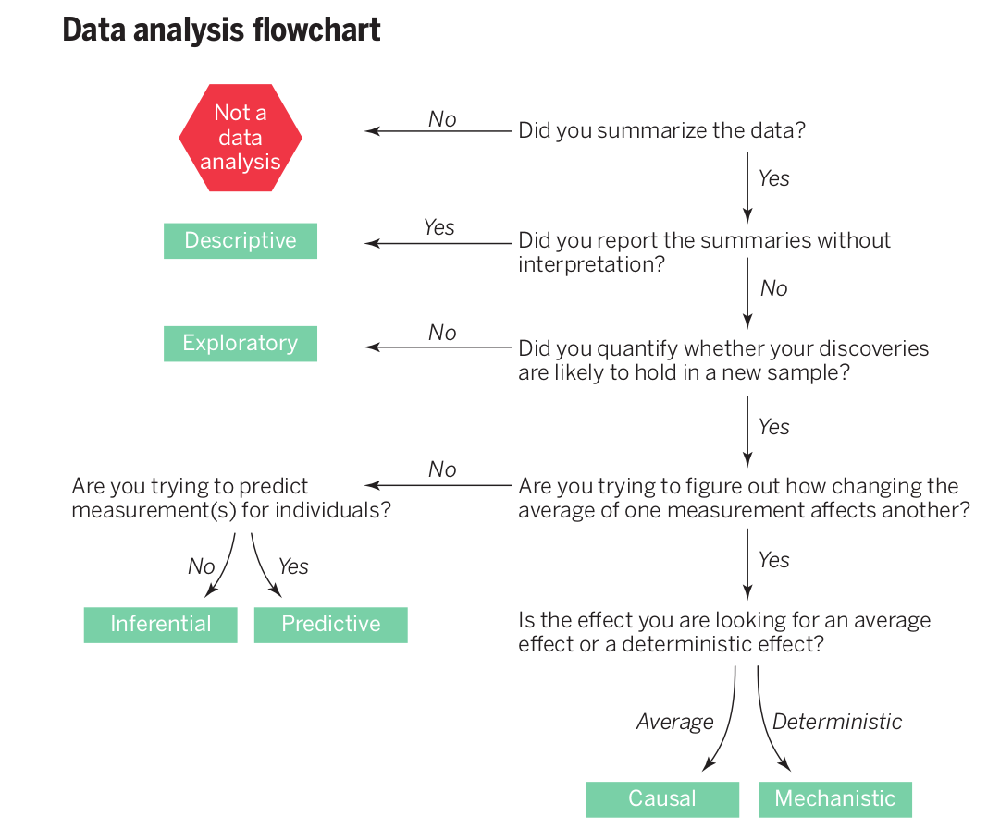

```{r setup, include=FALSE}
knitr::opts_chunk$set(echo = TRUE)
```


<!--
https://data36.com/statistical-bias-types-explained/
https://online.hbs.edu/blog/post/types-of-statistical-bias
https://towardsdatascience.com/what-is-statistical-bias-and-why-is-it-so-important-in-data-science-80e02bf7a88d
-->

I was discussing Data Science with a Journalist the other day, and a question came up, Why are Boxplots important with respect to Exploratory Data Analysis? Boxplots and Histograms are the first tools taught when learning statistical software, but why? Many online-courses (I've seen) gloss over the "WHY."

>For more on Exploratory Data Analysis, I recommend [Exploratory Data Analysis with R](https://leanpub.com/exdata) by Roger Peng, and it's FREE.
>Even if you don't use R (yet) it has some nuggets.

## What is wrong with your data?

Since this discussion started with a journalist co-worker, I was reminded of the 5 W's of reporting:

1. Who 
2. What
3. When 
4. Where 
5. Why 

- How might a journalist think of the five W's when analyzing a dataset. 

- Can these five questions be useful when carrying out a Data Analysis? 

In short, **Yes**. 

**And**, I believe the five W's should be asked by Data Scientists too.

- **Why** is this data being analyzed?
    - Are we hypothesis testing?
    - Are we looking for a correlation or a regression line?  
    - Is the data normally distributed?  
</br>

- **When** and **Where** was the data collected?
    - If a political poll is asked in 2 cities, is it reasonable to assume that the entire country will poll the same way?
    - Could the time of day? day of the week? or season of the year change the data collected?  
</br>
   
- **Who** gathered this data?  
    - Is it important what prejudices that person or group had collecting the data?   
</br>
   
- And finally, **What** can be learned from the dataset?

What do these examples of asking the five W's have in common? In my mind, they all dive deep into the story or (in this case) the data bias.

>Bias - Inclined to one side; swelled on one side; an inclination; to give a particular direction to; to influence; to prejudice; to prepossess.
>
>Webster, 1913

I believe the five W's are a good way to focus ones skepticism. The five W's give a roadmap that scientists can use too. 

- Is there anything wrong with your data?
- What is its source?
- Who or what compiles your data?
- Where and when was it generated?
- As Data Scientists, can we understand where biases can be introduced?


#### Why does a Data Science need to understand bias?

In much of the world of scientific research, people study the simplest, smallest pieces. Cell biologists design experiments based a single cell type. This reductionist approach is common is science. 

But what happens when people are studied? What happens when a political poll is asked of a number of people in *two cities*. Can that poll be generalized to include everyone in that county, state, and country?

Exploratory Data Analysis is the first review of your data and information. 

EDA is a first attempt to investigate what is right and wrong with your dataset.

There are two types of bias.

1. Conscious Bias
1. Unconscious Bias, also called implicit bias


>Bias: Favorable or unfavorable attitudes, or beliefs about a group [or subject] that informs how we perceive, interact, behave toward the group that are automatically activated.
>
>https://libraryguides.saic.edu/learn_unlearn/foundations6

Unconscious bias 

>In an unbiased random sample, every case in the population should have an equal likelihood of being part of the sample.
>
>Jenny Gutbezahl, [HBS Online](https://online.hbs.edu/blog/post/types-of-statistical-bias)

#### Sampling Bias

If we think of a political poll, the study should have about the same fraction (percent, proportion, ratio) of college educated vs non-college educated volunteers. If the poll is carried out at a high school will we find the same percent of college-educated versus non-educated in a school of 13-18 year-olds and only several dozen teachers?

3 Ways to Avoid Sampling Bias: 

1. Consider sample size. 
    - Having a *"large"* pool could provide enough randomness in your study to smooth out problems. How much is *"large"*? Good question.  

2. Define a target population.
    - Make online surveys as short and accessible as possible.
    - Follow up with non-responders.
    - Avoid convenience sampling.


##### Bias in Assignment

Assignment bias can also be called selection bias. 

Pretend you are a teacher. You ask for student volunteers to check the spelling or grammar of several papers. Ask your yourself, will this teacher find the students with an average grammar or spelling skills? Probably not. In most studies the 'volunteers' are themselves chosen from select groups that have a similar ratio English majors as Chemistry majors as in the school population.


---


Jeff Leek and Roger Peng have an interesting view of Data Science in the article, 'What is the Question?'[^1]

[^1]:Science, 20 MARCH 2015, VOL 347, ISSUE 6228, P. 1314



In the flowchart above, Data Science and Statistics can be broken down into 6 categories. In this piece, I will be focusing on Exploratory Data Analysis (EDA).
 
 
<!-- 
Conversely, can Data Scientists learn from Journalists? Are Data Scientists acting similarly to investigative reporters, who look for problems with the goal being to bring a story to light?
-->

I plan to investigate two mathematical perturbations that can be interpreted using Boxplots and Histograms. Two common measures for distributions are skew and kurtosis.


>Perturbation, in mathematics, a method for solving a problem by comparing it with a similar one for which the solution is known. Usually the solution found in this way is only approximate.
>
>https://www.britannica.com/science/perturbation-mathematics


But first, let us prepare some good and bad data.

#### Generate a dataset
```{r}
# Create data
names <- c(rep("A", 15) , rep("B", 15) , rep("C", 15))
value <- c( rpois(15, 5) , rnorm(15, mean=10, sd=15) , rnorm(15, mean=40, sd=10) )
data <- data.frame(names,value)

boxplot(data$value ~ data$names , col=terrain.colors(4), horizontal = T )
```


Square Values
```{r}
skewed_1 = (1/2)*(data$value)^2
data <- cbind(data, skewed_1)

boxplot(data$skewed_1 ~ data$names , col=terrain.colors(4), horizontal = T )
```


https://statisticsglobe.com/jitter-r-function-example/
https://stackoverflow.com/questions/23675735/how-to-add-boxplots-to-scatterplot-with-jitter
https://www.data-to-viz.com/caveat/boxplot.html


